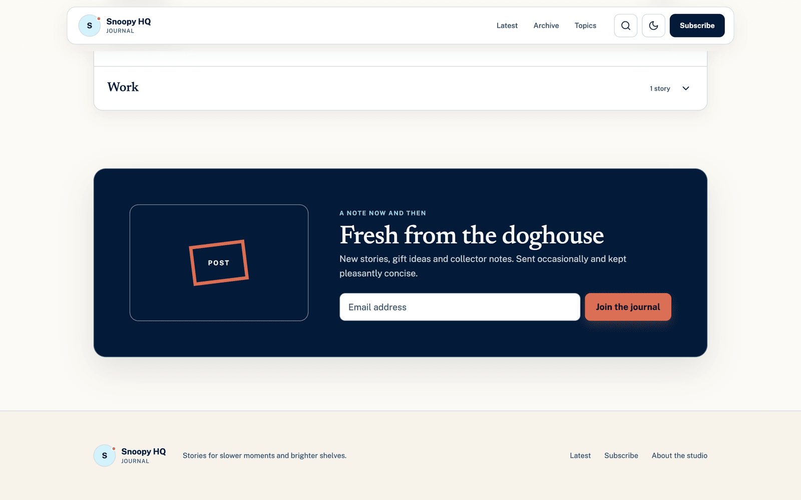

# Snoopy HQ Journal

**This project is a blog.** Articles, photographs, and downloadable attachments, presented as an online magazine.

What is unusual is how content gets in. There is no admin panel and no database: you put a folder of files on disk, and the site validates it, publishes it, and rebuilds itself around it. Photographs automatically get responsive sizes and a zoomable viewer. Word, PowerPoint, Excel, CSV and PDF attachments open **inside the page** — nothing is uploaded anywhere, and readers never have to download a file to read it.

**Stack** — Next.js 16 App Router · React 19 Server Components · framer-motion · sharp · [Flyfish `@file-viewer`](https://github.com/flyfish-dev/file-viewer). Deploys to **Vercel**; a Cloudflare Worker build ([vinext](https://github.com/cloudflare/vinext)) is kept as an alternative target.

---

## 👉 Start here

**Find the row that describes you. Open that one document. Ignore the rest until it does.**

| If you are… | Open this | Time | You will end up able to |
| --- | --- | --- | --- |
| **New to this project** — you have never seen it, and possibly never used React or Cloudflare either | **[docs/GETTING-STARTED.md](docs/GETTING-STARTED.md)** | ~45 min | Run the site, understand every term, publish an article |
| **Here to publish or edit content** and nothing else | [docs/MAINTAINER-MANUAL.md](docs/MAINTAINER-MANUAL.md) | ~15 min | Add, edit and remove articles, images and attachments |
| **About to change code** | [docs/PROJECT-HANDBOOK.md](docs/PROJECT-HANDBOOK.md), then [docs/COMPONENT-REFERENCE.md](docs/COMPONENT-REFERENCE.md) | ~90 min | Know how it fits together and which file to open |
| **Taking over the project** | [PROJECT_HANDOVER.md](PROJECT_HANDOVER.md) | ~20 min | Know the current state, risks and open gaps |
| **Just curious what it looks like** | [The feature tour below](#feature-tour) | ~5 min | See every feature, with screenshots |

Still unsure? Read the first row. It is written for someone who knows nothing about this project and assumes no stack knowledge.

### Or run it right now

```bash
npm install
npm run dev     # site + article-import watcher on http://localhost:3000
```

Node.js `>=22.13.0`. No database, no Docker, no accounts, no `.env` — it runs with zero configuration.

Every document is listed in the [documentation index](docs/README.md).

---

## Feature tour

Every screenshot below is the running site at `localhost:3000`.

### The front page


Server-rendered editorial layout. The header condenses on scroll (`data-condensed`, with a 72px/16px hysteresis band so it cannot flicker at the boundary), and every interactive control — search, theme, menu — is a small client island inside otherwise static HTML.

*Implementation:* [`app/page.tsx`](app/page.tsx), [`blog-header.tsx`](app/components/blog-header.tsx), [`navigation/scroll-aware-header.tsx`](app/components/navigation/scroll-aware-header.tsx)

---

### Featured stories and the archive grid


One lead story plus two recent favourites, taken from `featuredPosts` (`posts.slice(0, 3)`). The lead image is the page's LCP element and is the only image marked `priority` — which becomes `loading="eager"` and `fetchPriority="high"`.


The rest of the journal in a card grid. Each card is a **single** `<a>` wrapping media, meta, title and summary — one tab stop, one hit target, no duplicate links for screen-reader users.

*Implementation:* [`featured-stories.tsx`](app/components/featured-stories.tsx), [`latest-stories.tsx`](app/components/latest-stories.tsx), [`post-card.tsx`](app/components/post-card.tsx)

---

### Browse by topic


A single-open accordion built on the disclosure pattern: the trigger is a `<button>` inside an `<h3>` (heading stays in the outline, control stays operable), `aria-expanded` + `aria-controls` connect it to the panel, and the panel uses the real `hidden` attribute so closed content leaves both the accessibility tree and the tab order.

*Implementation:* [`category-browser.tsx`](app/components/category-browser.tsx)

---

### Newsletter



Two layouts (home and article) around one form. **The form does not submit anywhere yet** — the success message says so rather than faking a subscription. Wiring it to a provider is a tracked gap in the handbook.

*Implementation:* [`newsletter-signup.tsx`](app/components/newsletter-signup.tsx), [`newsletter-form.tsx`](app/components/newsletter-form.tsx)

---

### Dark mode without a flash


Theme is a DOM attribute (`data-theme`), not React state. A blocking inline script in `<head>` sets it before first paint from `localStorage` (falling back to `prefers-color-scheme`), so navigating never produces a white flash. The toggle writes the attribute, `colorScheme`, `localStorage`, and dispatches a `snoopy-theme-change` event; subscribers read it through `useSyncExternalStore`.

*Implementation:* [`app/layout.tsx`](app/layout.tsx), [`theme-toggle.tsx`](app/components/theme-toggle.tsx), tokens in [`app/globals.css`](app/globals.css)

---

### Search


Client-side search across title, summary, category and tags. No API — the corpus ships with the bundle, which is the right call at this scale. Full modal contract: focus moved to the input, Tab trapped, Escape closes, background scroll locked and restored, focus returned to the trigger.

*Implementation:* [`search-dialog.tsx`](app/components/search-dialog.tsx)

---

### Responsive down to phones

| Mobile home | Menu open |
| --- | --- |
|  |  |

Opening the menu moves focus to the first link and registers an Escape handler that closes it and returns focus to the button. Tapping any link closes the panel, so a hash link never leaves the menu covering its own destination.

---

### Article page


Breadcrumb, category, title, summary, byline, share. Dates are stored human-readable (`22 July 2026`) and converted to ISO for the `<time datetime>` attribute. Share uses `navigator.share` where it exists and falls back to the clipboard — and correctly treats a dismissed share sheet as *not* an error.


Images and documents are attached to paragraph positions in the content file, not embedded in prose:

```jsonc
"images": [{ "imageKey": "the-gaol", "afterParagraph": 0 }]   // 0 = after the first paragraph, -1 = before it
```


*Implementation:* [`article-view.tsx`](app/components/article-view.tsx), [`article-body.tsx`](app/components/article-body.tsx), [`article-header.tsx`](app/components/article-header.tsx)

---

### Table of contents with scroll-spy


Appears automatically when an article has 4+ sections or 1000+ words. It does **not** use `IntersectionObserver` — with sections of wildly different lengths and a sticky header covering the top of the viewport, threshold crossings give wrong answers. Instead it computes, per animation frame, which section occupies the most visible pixels, with fallbacks for "nothing visible" and "bottom of document".

Clicking an entry records a pending target so the highlight does not flicker through every section during the smooth scroll; the pending state clears on arrival, on `scrollend`, after 1800ms, or the instant you scroll yourself.

*Implementation:* [`article-table-of-contents.tsx`](app/components/article-table-of-contents.tsx)

---

### Image viewer — zoom, pan, pinch


Click any article photograph to open a full-screen viewer.


| Input | Action |
| --- | --- |
| Wheel | Zoom about the cursor |
| Double-click | 2×, or reset if already zoomed |
| Drag / pinch | Pan / zoom about the midpoint |
| `+` `-` `0` | Zoom in, out, reset |
| Arrows | Pan (Shift = larger step) |
| Escape | Close |

Zoom is focal-point correct — the pixel under your cursor stays under your cursor — and quantised to quarter steps so a trackpad pinch lands on 150%, not 147%. Zoom level is announced to screen readers through a polite live region.

*Implementation:* [`media/focused-image-dialog.tsx`](app/components/media/focused-image-dialog.tsx), [`media/image-zoom-controls.tsx`](app/components/media/image-zoom-controls.tsx)

---

### Photo permalinks


Every image in the library is statically generated at `/photo/{assetId}` — a shareable page for one photograph, with dimensions, caption and a link to the original file. Returning to the article restores your scroll position (a `sessionStorage` intent flag written on click, consumed once on arrival).

*Implementation:* [`photo/photo-focus-view.tsx`](app/components/photo/photo-focus-view.tsx), [`motion/scroll-memory.ts`](app/components/motion/scroll-memory.ts)

---

### Responsive images

Every content image goes through one component. `sharp` pre-generates AVIF and WebP at 480/768/1200/1600 (never wider than the original) into `/public/_optimized/`, and the markup is a plain `<picture>` with three tiers:

```tsx
<picture>
  <source type="image/avif" srcSet="/_optimized/…-768.avif 768w, …" sizes="…" />
  <source type="image/webp" srcSet="/_optimized/…-768.webp 768w, …" sizes="…" />
  
</picture>
```

No `next/image`: the app is a Worker with no image-optimisation runtime, and the variants are already static files. If the optimiser never ran, the AVIF/WebP sources 404 and the original still loads.

*Implementation:* [`media/responsive-image.tsx`](app/components/media/responsive-image.tsx), [`scripts/optimize-images.mjs`](scripts/optimize-images.mjs)

---

### Document attachments


An attachment renders as a card: format, size, title, caption, **Preview** and **Download**. Download is a real `<a download>` — it works without JavaScript and needs no viewer code.

Clicking Preview opens the document in the page:

| Spreadsheet / CSV | PDF |
| --- | --- |
|  |  |

| Word | PowerPoint |
| --- | --- |
|  |  |

Nothing is uploaded anywhere. The file is parsed in your browser by [Flyfish `@file-viewer`](https://github.com/flyfish-dev/file-viewer), with all workers, WASM and font data self-hosted under `/vendor/`.

Loading happens in three tiers, so a reader who never opens an attachment downloads none of it:

| Tier | Trigger | Loads |
| --- | --- | --- |
| 1 | Server render | The card only |
| 2 | Hover / focus / touch on the card | Viewer chunk begins downloading |
| 3 | Preview clicked | Viewer mounts, document bytes fetched |

*Implementation:* [`app/components/document/`](app/components/document) (11 files) — see the [component reference](docs/COMPONENT-REFERENCE.md) §8.

---

## Publishing content

Drop a folder into `imports/articles/`, and the running watcher does the rest:

```
imports/articles/my-story/
├── article.md            # frontmatter + prose
├── images/hero.jpg
└── documents/notes.xlsx
```

The importer validates the package, reads real image dimensions, hashes every file, stages the result privately, commits it with an atomic rename, writes a receipt, and only then deletes your folder. If anything fails, your folder is still there, untouched, and nothing was written.

Full instructions — adding, editing, removing articles and assets — are in the [maintainer manual](docs/MAINTAINER-MANUAL.md).

---

## Commands

| Command | Does |
| --- | --- |
| `npm run dev` | Site (Next) + import watcher |
| `npm run build` | Production build (`next build`) — this is what Vercel runs |
| `npm run verify:build` | Production build, then assert the deployable output is correct |
| `npm test` | Cloudflare Worker build, then import and rendered-HTML checks |
| `npm run build:worker` | Cloudflare Worker build (the alternative deploy target) |
| `npm run lint` | ESLint |
| `npm run import:articles:dry-run` | Validate pending packages, change nothing |
| `npm run import:articles` | Import pending packages and optimise images |
| `npm run optimize:images` | Regenerate responsive variants |
| `npm run db:generate` | Drizzle migrations (schema is currently empty) |

---

## Building the document preview: what Flyfish actually took

The in-page Word/PowerPoint/Excel/PDF preview was the hardest feature in this project, and the only one where I had to work directly from [the Flyfish `file-viewer` documentation](https://github.com/flyfish-dev/file-viewer) rather than from intuition. `npm install` and dropping `<FileViewer url=… />` into a component gets you a blank panel. Here is every wall I hit and what the fix turned out to be — recorded so the next person does not repeat the week.

### 1. The renderers do not ship themselves

The React component is the small part. The actual parsing happens in web workers and WASM modules that are **not** bundled by importing the package — they have to be copied into your served assets, and the viewer fetches them at runtime by URL. Nothing tells you this until previews silently fail.

The fix is the official Vite plugin, and both options matter:

```ts
// vite.config.ts
import { fileViewerRenderers } from "@file-viewer/vite-plugin";

plugins: [
  fileViewerRenderers({ copyAssets: true, chunkStrategy: "renderer" }),
  …
]
```

`copyAssets: true` writes the worker/WASM/font payloads into `public/`; `chunkStrategy: "renderer"` splits each format's engine into its own chunk instead of one giant bundle. You can confirm it worked from the dev log:

```
[file-viewer:vite-plugin] Copied 18/18 renderer assets to …/public
```

If that line is missing, every preview will fail and the error will point at a worker URL, not at the plugin.

### 2. Every renderer needs its own explicit, absolute asset URLs

Relative worker URLs resolve against the current route. Previews worked on `/` and broke on `/blog/some-article` — the worker was being fetched from `/blog/vendor/…`. Each renderer also takes a *different* option shape, which is documentation-only knowledge:

```ts
const PDF_OPTIONS = Object.freeze({
  streaming: "same-origin",
  workerUrl: "/vendor/pdf/pdf.worker.mjs",
  cMapUrl: "/vendor/pdf/cmaps/",              // omit → CJK text renders blank
  wasmUrl: "/vendor/pdf/wasm/",
  standardFontDataUrl: "/vendor/pdf/standard_fonts/",  // omit → non-embedded fonts vanish
});

const DOCX_OPTIONS = Object.freeze({
  worker: true,
  workerUrl: "/vendor/docx/docx.worker.js",
  workerJsZipUrl: "/vendor/docx/jszip.min.js",  // a second, separate worker asset
  progressive: true,
});

const PRESENTATION_OPTIONS = Object.freeze({
  workerUrl: "/vendor/pptx/pptx.worker.js",
  workerType: "classic",   // module workers fail here — this one cost hours
});

const SPREADSHEET_OPTIONS = Object.freeze({
  worker: "auto",
  workerUrl: "/vendor/xlsx/sheet.worker.js",
  resizableColumns: true,
  resizableRows: true,
});
```

Four renderers, four different vocabularies: `worker: true`, `worker: "auto"`, `workerType: "classic"`, plus a nested second worker for JSZip. None of it is guessable.

*Implementation:* [`document/document-viewer-options.ts`](app/components/document/document-viewer-options.ts)

### 3. JSZip expects Node globals in the browser

The DOCX and XLSX paths use JSZip, whose browser entry still reaches for `Buffer`, `stream` and `util`. Vite externalises them and the preview dies before it starts. The fix is aliases plus three real dependencies:

```ts
resolve: {
  alias: {
    buffer: path.resolve("node_modules/buffer/index.js"),
    stream: path.resolve("node_modules/stream-browserify/index.js"),
    util:   path.resolve("node_modules/util/util.js"),
  },
},
```

### 4. It cannot exist in a Server Component

This project is React Server Components by default. The viewer touches `window`, `Worker` and `document` at import time, so importing it anywhere in a server tree breaks the build. Three things were needed:

- a leaf module with `"use client"` and a **default export**, because `React.lazy` requires one;
- `createPortal` into `document.body`, guarded so the module is import-safe on the server;
- one shared import expression, so `React.lazy` and the hover preloader warm the *same* chunk:

```ts
export const loadDocumentViewer = () => import("./document-viewer");
export const preloadDocumentViewer = () => void loadDocumentViewer();
```

Two separate `import("./document-viewer")` call sites produce two chunks, and the preload warms the one you are not about to use.

### 5. Serving the bytes correctly is half the battle

The viewer fetches the file over HTTP, so the response headers are part of the feature. Missing or sniffed content types produce a viewer that loads and then renders nothing.

Production sets them statically:

```
/documents/*.xlsx
  Content-Type: application/vnd.openxmlformats-officedocument.spreadsheetml.sheet
  Content-Disposition: inline
  X-Content-Type-Options: nosniff
```

And `streaming: "same-origin"` for PDF means the renderer issues **HTTP range requests**. Vite's dev server does not do that for the private fixture route, so the dev middleware had to implement `Accept-Ranges`, `206 Partial Content`, `Content-Range` and `416` by hand — otherwise PDFs behave differently in development and production, which is the worst possible failure mode.

*Implementation:* [`public/_headers`](public/_headers), `localTestDocuments()` in [`vite.config.ts`](vite.config.ts)

### 6. Document CSS wants to redecorate your site

Office documents carry their own styling, and the renderer injects it. Without isolation, opening a deck restyled the article behind it. One option fixes it — and it has to be set at construction, not later:

```ts
styleIsolation: "shadow"
```

### 7. Theming is construction-time, so theme changes need a remount path

The viewer takes `theme` in its options object. Toggling the site theme while a preview is open does nothing unless you feed it a new options object. Since the site's theme lives in a DOM attribute, the dialog watches that attribute and memoises options per theme:

```tsx
function subscribeToTheme(callback: () => void) {
  const observer = new MutationObserver(callback);
  observer.observe(document.documentElement, { attributes: true, attributeFilter: ["data-theme"] });
  return () => observer.disconnect();
}
const theme = useSyncExternalStore(subscribeToTheme, readTheme, () => "light");
```

### 8. Failures are normal, so recovery had to be designed in

Real-world files fail: a truncated upload, a chunk that 404s behind a stale cache, a format edge case. Three layers handle it:

- **A React error boundary** — the only `class` in this codebase, because `getDerivedStateFromError` has no hook equivalent. It contains parser and lazy-chunk crashes so one attachment cannot take down the article.
- **Retry by remount.** Retry increments a counter that is part of the component `key`, so the viewer is destroyed and recreated rather than resumed from a broken internal state.
- **A pure reducer** for `loading | ready | error`, because the viewer's `onStateChange` can fire repeatedly and out of order. Identity-stable no-ops mean a viewer that reports `loading` fifty times causes zero re-renders.

Plus a guard against a mislabelled file, which throws during render so the boundary catches it and the reader still gets a working Download link:

```tsx
const detectedExtension = normalizeFileExtension(getExtension(document.filename));
if (detectedExtension !== document.extension) {
  throw new Error(`Document extension mismatch for ${document.filename}.`);
}
```

### What I would tell someone starting today

Read the Flyfish docs for **your** renderer before writing any component code — the per-format option names are the whole game, and they differ. Get one format working end to end (CSV is the easiest) before adding the rest. Verify the plugin's "Copied N/N renderer assets" line early. And treat serving the file — MIME type, `inline`, `nosniff`, range support — as part of the integration, not as infrastructure someone else handles.

---

## Deploying to Vercel

The project builds with `next build` and deploys as a standard Next.js app.

### First deploy

```bash
npm i -g vercel        # once
vercel login
vercel                 # preview deployment
vercel --prod          # production deployment
```

Or connect the repository in the Vercel dashboard — no build settings to change, `vercel.json` declares them.

### What the build does on Vercel

```
npm install            # devDependencies included, which the build needs
prebuild
├── npm run assets:viewer   → copies the Flyfish renderer assets into public/vendor/
└── npm run optimize:images → generates AVIF/WebP variants into public/_optimized/
next build             → prerenders every article and photo page
```

Both `public/vendor/` and `public/_optimized/` are gitignored and regenerated at build time, so nothing large is committed and nothing is missing at runtime.

### Settings

| Setting | Value |
| --- | --- |
| Framework preset | Next.js (auto-detected) |
| Build command | `npm run build` (from `vercel.json`) |
| Install command | default |
| Node version | 22.x |
| Environment variables | none required |

`NEXT_PUBLIC_SITE_URL` is optional: set it to your custom domain so Open Graph URLs are absolute and correct. Without it the build falls back to Vercel's own deployment URL.

### What is excluded from the deployment

`.vercelignore` keeps local QA fixtures (`.local-test-assets/`), the Cloudflare Worker build path, the import inbox and tooling artifacts out of the upload.

### Verify before deploying

```bash
npm run verify:build
```

Builds, then asserts the home page, articles and photo permalinks prerendered, the dev-only fixture article is **absent**, and the document-renderer assets are present.

### The Cloudflare alternative

The Worker build is still wired up and tested:

```bash
npm run build:worker
npx wrangler deploy --config dist/server/wrangler.json
```

`npm test` exercises that path (`tests/rendered-html.test.mjs` renders through the Worker bundle). Cloudflare-specific pieces — `worker/index.ts`, `vite.config.ts`, `public/_headers` — are unused by the Vercel build; the equivalent headers live in `vercel.json`.

---

## Architecture in one paragraph

Content is frozen plain data (`app/content/`), never JSX. A registry factory builds id/slug lookups at module load and fails the build on duplicates. Pages are Server Components; only 20 of 45 component files are client islands. The Worker serves static HTML and static assets — no runtime image processing, no database in the request path (D1 and R2 bindings are declared but unused). Imports are transactional: staged, atomically renamed, receipted. See the [handbook](docs/PROJECT-HANDBOOK.md) for the long version.

---

## Local preview fixtures

The dev-only **Local document preview laboratory** article at `/blog/local-document-preview-lab` exercises every supported format. Its four fixtures are generated demonstration files — safe to screenshot, share in a pull request or paste into documentation:

| File | Exercises |
| --- | --- |
| `doc_demo_collecting_season.pptx` | Six slides: title, bullets, table, pull quote, two-column |
| `doc_demo_field_notes.docx` | Two pages, heading hierarchy, lists, two tables, explicit page break |
| `doc_demo_care_notes.pdf` | Four pages, tables, page navigation, range-request streaming |
| `doc_demo_collection_inventory.csv` | 11 columns × 120 rows for wide-table scrolling |

Fixtures live in `.local-test-assets/documents/`, which Git ignores. A development-only route handler ([`app/local-test-documents/[filename]/route.ts`](app/local-test-documents/%5Bfilename%5D/route.ts)) serves only allowlisted `.pptx`, `.docx`, `.xlsx`, `.pdf` and `.csv` filenames directly under `/local-test-documents/` (no subdirectories), with byte-range support, no caching and `nosniff`. It returns 404 when `NODE_ENV` is `production`, and `.vercelignore` keeps the files out of the deployment entirely. `app/content/local-preview-articles.ts` gates the article on `NODE_ENV`, so the production bundle contains a static empty array and the fixture metadata is dropped by dead-code elimination — verified by `npm run verify:build`.

To swap a fixture, drop the file into that folder and update the matching record in [`app/content/local-preview-article.ts`](app/content/local-preview-article.ts) — `filename`, `src`, `extension`, `mimeType` and `size` must all agree, because the viewer throws when a file's extension does not match its record. Anything you keep out of the served set (private QA files, real client documents) can sit in `.local-test-assets/documents/private/`: still gitignored, and unreachable by the dev route because the middleware rejects any path separator.

---

## Alternative target: Cloudflare Workers

The project can still build and deploy as a Cloudflare Worker, which is how it ran before the move to Vercel:

```bash
npm run build:worker
npx wrangler deploy --config dist/server/wrangler.json
```

That path uses [`worker/index.ts`](worker/index.ts), [`vite.config.ts`](vite.config.ts) and [`public/_headers`](public/_headers); the Vercel build ignores all three. `npm test` exercises it, because `tests/rendered-html.test.mjs` renders through the Worker bundle.

Optional Cloudflare bindings (D1, R2) are declared as `null` at the top of `vite.config.ts` — nothing reads from a database today, and `db/schema.ts` is intentionally empty.

---

## Learn more

- [Flyfish file-viewer](https://github.com/flyfish-dev/file-viewer)
- [vinext](https://github.com/cloudflare/vinext)
- [Drizzle D1 guide](https://orm.drizzle.team/docs/get-started/d1-new)
