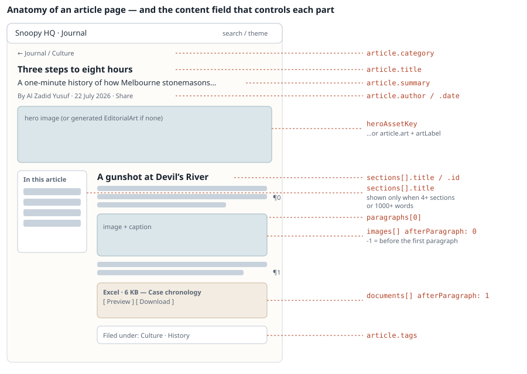

# Maintainer Manual — Snoopy HQ Journal

> **Landed here first?** This manual assumes the project is already running on your
> machine and that you know what an import package is. If either is not true, read
> [`GETTING-STARTED.md`](GETTING-STARTED.md) first — it takes about 45 minutes and covers
> setup, vocabulary and a narrated first article. All documents are routed from the
> [documentation index](README.md).

Everyday tasks, in order of how often you will do them. Copy-paste friendly.
For *why* anything works this way, see [`PROJECT-HANDBOOK.md`](PROJECT-HANDBOOK.md).

## Contents

0. [Before you start](#0-before-you-start)
1. [The mental model in one picture](#1-the-mental-model-in-one-picture)
2. [Add a blog post (the easy way — Markdown)](#2-add-a-blog-post-the-easy-way--markdown)
3. [Add a blog post (full control — JSON)](#3-add-a-blog-post-full-control--json)
4. [Where images and documents go, and how they attach](#4-where-images-and-documents-go-and-how-they-attach)
5. [Add or remove an asset on an article that is already published](#5-add-or-remove-an-asset-on-an-article-that-is-already-published)
6. [Edit a published article](#6-edit-a-published-article)
7. [Remove a blog post](#7-remove-a-blog-post)
8. [Re-importing and `importId`](#8-re-importing-and-importid)
9. [Troubleshooting](#9-troubleshooting)
10. [Before you commit](#10-before-you-commit)
11. [Quick reference](#11-quick-reference)

---

## 0. Before you start

```bash
npm install     # first time only, or after pulling new dependencies
npm run dev     # starts the site AND the import watcher
```

Open <http://localhost:3000>.

Leave `npm run dev` running while you work. It watches `imports/` and publishes anything
you drop in there automatically.

**Two golden rules**

1. To publish, change, or move content — you edit **content files**, never components.
2. Never hand-edit `content/index.json` while `npm run dev` is running.

---

## 1. The mental model in one picture


You put a folder in `imports/articles/`. The importer validates it, copies everything to
its permanent home, updates the registry, and **then** deletes your folder. If it deletes
your folder, it worked. If your folder is still there, read the terminal — it says why.

---

## 2. Add a blog post (the easy way — Markdown)

### Step 1 — make the folder

```bash
mkdir -p imports/articles/my-first-story/images
mkdir -p imports/articles/my-first-story/documents   # only if you have attachments
```

### Step 2 — put your files in

```
imports/articles/my-first-story/
├── article.md
├── images/
│   ├── hero.jpg
│   └── the-market.jpg
└── documents/
    └── timeline.xlsx
```

### Step 3 — write `article.md`

```markdown
---
title: A morning at the fish market
slug: a-morning-at-the-fish-market
category: Travel
date: 2026-08-05
author: Al Zadid Yusuf
description: Cold air, loud auctions and the best breakfast I have had in a year.
tags: [Travel, Japan, Food]
accent: sky
---

## Getting there

The train left before sunrise and arrived while the city was still deciding
whether to wake up.


*The first crates being wheeled out, a little after five.*

The auction floor is not open to everyone, and the queue starts earlier than
you would like.

## What to eat

1. **Tamago** Sweet, warm, and sold from a stall with no sign.
2. **Uni** Order it and stop asking questions.

[Full morning timeline](documents/timeline.xlsx)

*Every stop, with the times that actually worked.*

> The best meals are the ones you had to get up early for.

## Sources

- [Market opening times](https://example.com/times)
- [How the auction works](https://example.com/auction)
```

### Step 4 — publish

If `npm run dev` is running: **wait ~3 seconds.** The watcher imports it and the page
reloads. Watch the terminal:

```
[article-watch] articles/my-first-story: imported (art_9f2c…)
```

Otherwise, run it yourself:

```bash
npm run import:articles:dry-run    # check first — changes nothing
npm run import:articles            # actually publish
```

Your post is now at `http://localhost:3000/blog/a-morning-at-the-fish-market`.

### Markdown cheat sheet

| You write | You get |
|---|---|
| `## Heading` | A new section (also becomes a table-of-contents entry) |
| A blank-line-separated block of text | A paragraph |
| `` | An image, placed right where you wrote it |
| A line of `*italic text*` **directly after** an image or document | That item's caption |
| `[Label](documents/foo.xlsx)` on its own line | An attachment card with Preview + Download |
| `1.` / `2.` lines | A numbered list |
| `- ` lines | A bulleted list |
| `- [Label](https://…)` — a bullet list where **every** item is a link | A "sources" link list instead of a bullet list |
| `> text` | A pull-quote at the end of the section |
| `**Bold** rest of line` inside a list item | A labelled list item |

### Frontmatter fields

| Field | Required | Notes |
|---|---|---|
| `title` | ✅ | |
| `slug` | ✅ | lowercase-with-hyphens. This is the URL. |
| `category` | ✅ | Free text. A new category appears in "Pick a path" automatically. |
| `date` | ✅ | `2026-08-05` or `5 August 2026` |
| `author` | ✅ | |
| `description` | ✅ | (or `summary` / `dek`) Used on cards, search and social previews. |
| `tags` | — | `[One, Two]`. Defaults to the category. |
| `accent` | — | `sky` · `coral` · `teal` · `navy`. Card colour. Default `sky`. |
| `art` | — | `house` · `gift` · `shelf` · `type` · `weekend` · `city`. The illustration used when a post has no image. |
| `artLabel` | — | Text drawn inside that illustration. |
| `importId` | — | Defaults to `markdown-<slug>-v1`. See §8. |

---

## 3. Add a blog post (full control — JSON)

Use this when you need exact image placement, per-section attachments, or links to
related articles.

```bash
mkdir -p imports/articles/my-second-story/images
cp imports/articles/_template/article.json.example \
   imports/articles/my-second-story/article.json
```

(The `_template` folder itself is never imported — folders starting with `_` or `.` are
skipped.)

```json
{
  "schemaVersion": 1,
  "importId": "my-second-story-v1",
  "article": {
    "slug": "a-day-worth-remembering",
    "category": "Travel",
    "title": "A day worth remembering",
    "summary": "A concise summary used on cards, search and social previews.",
    "date": "5 August 2026",
    "author": "Al Zadid Yusuf",
    "tags": ["Travel", "Personal stories"],
    "accent": "sky",
    "art": "city",
    "heroAssetKey": "hero",
    "sections": [
      {
        "id": "the-first-stop",
        "title": "The first stop",
        "paragraphs": [
          "The first paragraph of the section.",
          "The second paragraph, followed by an image."
        ],
        "images": [{ "assetKey": "detail", "afterParagraph": 1 }],
        "documents": [{ "documentKey": "timeline", "afterParagraph": 1 }]
      }
    ],
    "relatedArticleIds": ["tokyo-skytree-and-shibuya"]
  },
  "assets": [
    {
      "key": "hero",
      "file": "images/hero.jpg",
      "title": "A wide opening view",
      "alt": "Describe what is visible, for readers who cannot see the image",
      "caption": "The caption shown beneath the image."
    },
    {
      "key": "detail",
      "file": "images/detail.jpg",
      "title": "A closer detail",
      "alt": "A clear description of the detail photograph",
      "caption": "A second caption tied to this exact asset.",
      "portrait": true
    }
  ],
  "documents": [
    {
      "key": "timeline",
      "file": "documents/timeline.xlsx",
      "title": "The day, hour by hour",
      "caption": "Every stop and the times that actually worked."
    }
  ]
}
```

Then publish exactly as in §2 step 4.

**Two rules the validator will enforce:**

- Every `key` in `assets` / `documents` must be placed somewhere in the article.
- Every `assetKey` / `documentKey` placed in the article must exist in `assets` /
  `documents`.

No orphans, no dangling references.

---

## 4. Where images and documents go, and how they attach



### `afterParagraph` — the only positioning rule you need

| Value | Where it renders |
|---|---|
| `-1` | Right after the section heading, before any text |
| `0` | After the **first** paragraph |
| `1` | After the second paragraph |
| `n` | After paragraph `n+1` |

```json
"paragraphs": ["First.", "Second.", "Third."],
"images": [
  { "assetKey": "top",    "afterParagraph": -1 },
  { "assetKey": "middle", "afterParagraph": 1  }
]
```

renders: image(top) → "First." → "Second." → image(middle) → "Third."

**To move an image or attachment**, change that one number and re-import (or, for an
already-published article, edit the number in the two JSON files — see §6).

### Image rules

| Rule | Value |
|---|---|
| Formats | JPEG, PNG, WebP, AVIF |
| Max per file | 25 MB |
| Max per package | 250 MB total, 30 images |
| Max pixels | 200 megapixels |
| `alt` | **Required.** Never publish without it. |
| Path | Must be relative and inside the package. No `../`, no absolute paths, no symlinks. |

Add `"portrait": true` to a tall photo — it switches to the narrower layout.

You do **not** resize images yourself. `npm run dev` / `npm run build` generate AVIF and
WebP at 480 / 768 / 1200 / 1600 px into `public/_optimized/` automatically.

### Document (attachment) rules

| Rule | Value |
|---|---|
| Formats | `.pptx` `.docx` `.xlsx` `.csv` `.pdf` — modern formats only |
| Rejected | `.ppt` `.doc` `.xls`, macro-enabled variants (`.docm`, `.xlsm`, …) |
| Max per file | 50 MB (CSV: 10 MB) |
| Max per package | 12 documents |
| CSV | Must be valid UTF-8 |

Each attachment renders as a card with **Preview** (opens in the browser, no download) and
**Download**.

---

## 5. Add or remove an asset on an article that is *already published*

The importer never overwrites. For a published article you edit the canonical files by
hand. **Stop `npm run dev` first.**

You must keep **two** files in sync — they contain the same record:

- `content/articles/<articleId>.json` — the article on its own
- `content/index.json` → the matching entry inside its `"articles"` array

### Adding an image

1. Put the file at `public/images/articles/<articleId>/<newAssetId>.jpg`
   (any stable name works; the `asset_…` convention just matches the importer).
2. Add the asset record to `content/index.json` → `"assets"`, and its id to `"assetIds"`:

```json
{
  "id": "asset_market_dawn",
  "articleId": "art_9f2c…",
  "articleSlug": "a-morning-at-the-fish-market",
  "title": "Crates at dawn",
  "src": "/images/articles/art_9f2c…/asset_market_dawn.jpg",
  "width": 2000,
  "height": 1333,
  "alt": "Stacked crates of ice on a wet market floor before sunrise",
  "caption": "The first crates being wheeled out, a little after five."
}
```

> `width` and `height` must be the **real** pixel dimensions. Check with:
> ```bash
> npx --yes image-size public/images/articles/art_9f2c…/asset_market_dawn.jpg
> ```

3. Place it in the article by adding the same object **plus `afterParagraph`** to the
   section's `images` array — in *both* `content/articles/<articleId>.json` and the copy
   inside `content/index.json`.
4. `npm run optimize:images && npm run dev`

### Removing an image

1. Delete it from the section's `images` array in both files.
2. Delete its entry from `"assets"` and its id from `"assetIds"` in `content/index.json`.
3. Delete the files:

```bash
rm public/images/articles/<articleId>/<assetId>.jpg
rm content/assets/<articleId>/<assetId>.json
rm -rf public/_optimized/images/articles/<articleId>   # variants regenerate
```

4. `npm run dev` and check the article and the homepage card still look right.

> **Careful:** the homepage card uses an article's **first** image. Deleting it changes
> which picture appears on the card.

### Adding or removing an attachment

Same shape, different folders:

- file → `public/documents/articles/<articleId>/<docId>.xlsx`
- record → `content/index.json` → `"documents"` + `"documentIds"`
- placement → the section's `documents` array in both files

The record's `mimeType` **must** match the extension exactly, or the build fails:

| Extension | `mimeType` |
|---|---|
| `.pdf` | `application/pdf` |
| `.csv` | `text/csv; charset=utf-8` |
| `.docx` | `application/vnd.openxmlformats-officedocument.wordprocessingml.document` |
| `.xlsx` | `application/vnd.openxmlformats-officedocument.spreadsheetml.sheet` |
| `.pptx` | `application/vnd.openxmlformats-officedocument.presentationml.presentation` |

`size` must be the real byte count:

```bash
stat -f%z public/documents/articles/<articleId>/<docId>.xlsx
```

---

## 6. Edit a published article

**Stop `npm run dev` first.**

| What you are editing | File |
|---|---|
| An **imported** article (id starts `art_…`) | `content/articles/<articleId>.json` **and** the same record in `content/index.json` |
| A **built-in** article (e.g. `tokyo-skytree-and-shibuya`) | `app/content/static-articles.ts` |

Safe to change freely: `title`, `summary`, `paragraphs`, `quote`, `list`, `references`,
`tags`, `category`, `accent`, `art`, `caption`, `alt`, `afterParagraph`.

Change with care:

| Field | Why |
|---|---|
| `slug` | Breaks existing links. Also update any `related` entry that used the old slug. |
| `id` | Don't. Images, documents and related links all point at it. |
| `date` | Changes the article's position in the feed and what is "featured". |
| `sections[].id` | It is the `#anchor` — old links to that section break. |

Then:

```bash
npm run dev      # confirm it renders
npm test         # confirm nothing else broke
```

---

## 7. Remove a blog post

There is no delete script yet. Do it in this order, with `npm run dev` **stopped**.

Say the article is `art_036d0a4179dd79db7d9dff25`, slug `devils-river-murder-1863`.

**1. Delete its files**

```bash
rm  content/articles/art_036d0a4179dd79db7d9dff25.json
rm -rf content/assets/art_036d0a4179dd79db7d9dff25
rm -rf content/documents/art_036d0a4179dd79db7d9dff25
rm -rf public/images/articles/art_036d0a4179dd79db7d9dff25
rm -rf public/documents/articles/art_036d0a4179dd79db7d9dff25
rm -rf public/_optimized/images/articles/art_036d0a4179dd79db7d9dff25
```

**2. Edit `content/index.json`** — remove the article from **all** of these:

| Key | Remove |
|---|---|
| `articleIds` | the `art_…` string |
| `slugs` | the slug string |
| `assetIds` | every `asset_…` belonging to it |
| `documentIds` | every `doc_…` belonging to it |
| `articles` | the object whose `id` matches |
| `assets` | every object whose `articleId` matches |
| `documents` | every object whose `articleId` matches |
| `imports` | the entry whose `articleId` matches |

**3. Remove inbound references** — search for the id and slug across the repo:

```bash
grep -rn "art_036d0a4179dd79db7d9dff25\|devils-river-murder-1863" content app
```

Delete any hits inside another article's `related` / `relatedArticleIds`, and any entry in
`app/content/document-placements.ts`.

**4. Verify**

```bash
npm run build && npm test
```

A duplicate or dangling id fails the **build** with a message naming the id — that is the
safety net working.

> **Removing a built-in article** instead: delete its object from
> `app/content/static-articles.ts`, its images from `app/content/media-assets.ts`, its
> documents from `app/content/document-assets.ts` and `document-placements.ts`, then the
> files under `public/images/…`.

---

## 8. Re-importing and `importId`

Every import is remembered by its `importId`.

| Situation | Result |
|---|---|
| Same `importId`, **identical** files | Importer confirms the article is intact and just removes the duplicate inbox folder. Safe. |
| Same `importId`, **different** files | ❌ `Import ID "…" was already used by a different package.` |
| New `importId`, but same `slug` | ❌ `Article slug "…" already exists.` |

To genuinely re-publish a changed article: **delete the old one** (§7), then import with a
bumped id (`my-story-v2`).

---

## 9. Troubleshooting

| Symptom | Cause and fix |
|---|---|
| Folder still sitting in `imports/`, nothing happened | Read the terminal. The importer prints the exact field and reason. Fix it — the watcher retries only after a file changes. |
| `contains the unsupported field "sumary"` | Typo in a field name. Unknown fields are always rejected. |
| `Asset key "x" is declared but never placed` | You listed an image but never referenced it in a section. |
| `Article references undeclared asset key "x"` | The reverse — placed but not declared. |
| `article.date must use a real date` | Use `5 August 2026` or `2026-08-05`. |
| `Another article import is already running` | A crashed run left a lock. `rm .article-import/import.lock` |
| `Duplicate article id` / `Duplicate article slug` on **build** | Two articles collide. Check `content/index.json` against `app/content/static-articles.ts`. |
| Images 404 or the site looks unstyled after a fresh clone | Generated folders are missing. Run `npm run dev` (or `npm run build`) once. |
| Document Preview spins forever or shows the retry panel | Usually a corrupt or legacy-format file. Confirm it opens in Office; check the browser console. |
| Post published but not on the homepage | Ordering is by `date`, newest first. An old date puts it in "From the archive", not "Start with these stories". |
| Changed `content/index.json` and nothing updated | Restart `npm run dev`. |

Watcher status, if you want to see what it is doing:

```bash
cat .article-import/watcher.json
```

---

## 10. Before you commit

```bash
npm run lint
npm test          # builds the site, then runs both test suites
```

Commit these:

```
content/index.json
content/articles/**
content/assets/**
public/images/**
public/documents/**
app/**            (only if you changed code or built-in content)
```

Never commit these (they are gitignored and regenerate themselves):

```
public/_optimized/    public/vendor/    dist/    .article-import/    .local-test-assets/
```

---

## 11. Quick reference

```bash
npm run dev                      # site + auto-import watcher
npm run dev:site                 # site only
npm run import:articles:dry-run  # validate the inbox, change nothing
npm run import:articles          # import + regenerate image variants
npm run optimize:images          # regenerate image variants only
npm run build                    # production build
npm test                         # build + all tests
npm run lint
```

| I want to… | Go to |
|---|---|
| Publish a post | `imports/articles/<name>/article.md` |
| Move an image inside a post | its `afterParagraph` |
| Change a card's colour | the post's `accent` |
| Change a post's URL | its `slug` (and any `related` pointing at it) |
| Reorder the category menu | `app/content/categories.ts` → `preferredCategories` |
| Change site colours | `app/globals.css` → `:root` and `:root[data-theme="dark"]` |
| Change which posts are "featured" | `app/content/articles.ts` → `posts.slice(0, 3)` |
| Change when the table of contents appears | `app/components/article-view.tsx` → `hasTableOfContents` |

---

### A note on the pictures in this manual

The two diagrams above are annotated schematics, drawn to map each on-screen element to
the exact content field that controls it — which a raw screenshot cannot do. To capture
real screenshots for a specific change, run `npm run dev` and use your browser's own
capture (macOS: <kbd>⌘⇧4</kbd>, then <kbd>Space</kbd> to grab a window), and drop the PNGs
into `docs/images/`.
