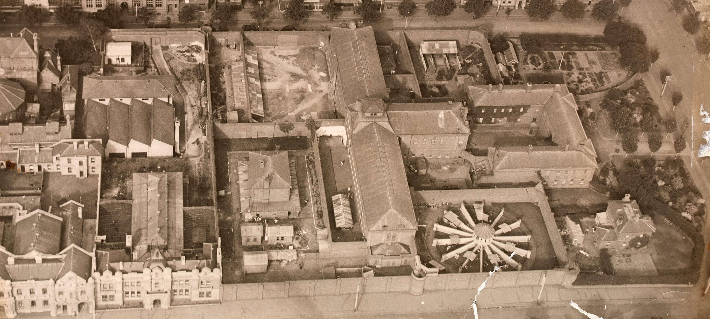

This history involves domestic violence, murder and execution. It is not a neat mystery story: the surviving record tells us what a colonial court decided, but it also shows how much that court left outside its frame.

## A gunshot at Devil’s River

Robert and Elizabeth Scott kept a remote refreshment house in the Wappan district near Mansfield. Around midnight on 11 April 1863, Robert Scott was killed by a single shotgun blast.

Police arrested Elizabeth and two men associated with the household, David Gedge and Julian Cross. The Crown’s case eventually presented the killing as a conspiracy. Forgotten Australia’s three-part *Murder at Devil’s River* series returns to the central question that still makes the case troubling: did the verdict explain what actually happened inside the shanty?

## The life the prosecution pushed aside

Public Record Office Victoria researcher Emma Beach reconstructed Elizabeth’s history from judicial records. At twelve, Elizabeth was sent to Goomalibee station as an indentured servant. Before she turned fourteen, the substantially older Robert Scott had acquired her contract and married her.

Beach’s archival study describes repeated domestic violence during the marriage. Yet the prosecution centred an alleged relationship between Elizabeth and Gedge as the motive for murder. Her experience of abuse was not developed by her defence as a reason to understand her conduct or mitigate her sentence. An all-male jury therefore heard a story about adultery and conspiracy, not the fuller history of coercion recorded around the case.

## Three convictions, one scaffold

Elizabeth Scott, David Gedge and Julian Cross were convicted of Robert Scott’s murder. A murder conviction then carried a mandatory death sentence. Public Record Office Victoria explains that the later capital-case review concerned whether mercy should commute that sentence, not whether the conviction itself was sound.

The Executive Council did not recommend mercy. On 11 November 1863, all three were executed at Melbourne Gaol. Elizabeth was 23 and became the first woman executed in the Colony of Victoria.

*Melbourne gaol in sunlight from the Public Library grounds, Frederick McCubbin, 1884. State Library Victoria; public domain.*

## Four facts that survive the uncertainty

1. **Robert Scott was killed.** He died from a gunshot at the household’s isolated roadside business on 11 April 1863.
2. **The colonial court convicted three people.** Elizabeth Scott, David Gedge and Julian Cross were held legally responsible and sentenced to death.
3. **The executions followed a separate mercy process.** The capital files could determine whether a death sentence was commuted, but did not retry guilt.
4. **Domestic violence belongs in the history.** Archival research documents sustained abuse and shows that it was not meaningfully presented in Elizabeth’s defence.

## What the record does not settle

The precise role of each accused remains contested in later accounts. It would be irresponsible to turn that uncertainty into a confident declaration of innocence; it would be equally misleading to treat the 1863 verdict as a complete and neutral account.

The most defensible conclusion is narrower. Robert Scott was murdered. Three people were convicted and hanged. But the process that judged Elizabeth treated her gender, marriage and alleged sexuality as more legible than the violence she had endured.

## Why this case is worth remembering

Forgotten Australia revived the case as a question about whether the gallows delivered justice. The archival record makes that question larger than the identity of the person who fired the weapon. It asks what justice can mean when a court recognises a violent death but fails to properly recognise the violence that came before it.

That is why the Devil’s River case should not be reduced to a macabre first—the first woman executed in Victoria—or packaged as a solved puzzle. Its value lies in the tension between verdict and history, and in the people and circumstances the official story struggled to see.

*The Old Melbourne Gaol precinct from the air in 1922, photographed by Sir Raymond Garrett. State Library Victoria; public domain.*

## Sources and further reading

- [Forgotten Australia — Murder at Devil’s River, Part One: Bob Scott is Shot!](https://shows.acast.com/forgotten-australia/episodes/murder-at-devils-river-part-one-bob-scott-is-shot)
- [Public Record Office Victoria — Attitudes to wife beating in colonial Victoria: the case of Elizabeth Scott](https://prov.vic.gov.au/explore-collection/provenance-journal/provenance-2019/attitudes-wife-beating-colonial-victoria)
- [Public Record Office Victoria — Capital case and capital sentence files](https://prov.vic.gov.au/explore-collection/explore-topic/criminal-court-cases/capital-case-and-capital-sentence-files)
- [National Trust of Australia (Victoria) — Women, Children and Gaol](https://www.nationaltrust.org.au/women-children-and-gaol/)
- [Wikimedia Commons — Frederick McCubbin, Melbourne gaol in sunlight, 1884](https://commons.wikimedia.org/wiki/File:Frederick_McCubbin_-_Melbourne_gaol_in_sunlight_from_the_Public_Library_grounds_(1884).jpg)
- [Wikimedia Commons — Old Melbourne Gaol aerial photograph, 1922](https://commons.wikimedia.org/wiki/File:Old_Melbourne_Gaol_aerial_1922_(cropped).jpg)
